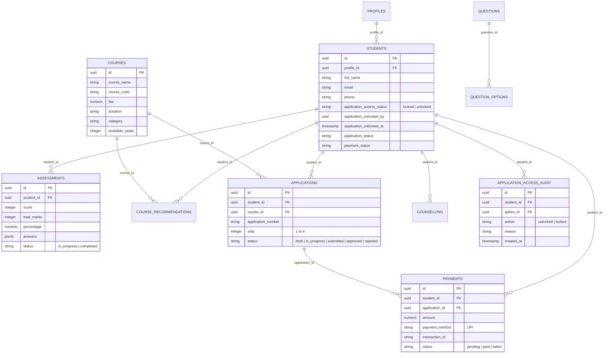

# TATTI Portal - Database Documentation

## 1. Overview
The TATTI Student Management Portal database is powered by PostgreSQL / Supabase with Row Level Security (RLS) policies and complete relational integrity.

Consolidated schema location: [`database/schema/full_schema.sql`](file:///c:/Users/acer/Downloads/tatti-portal-source-code/database/schema/full_schema.sql).
Seed script location: [`database/seed/seed_data.sql`](file:///c:/Users/acer/Downloads/tatti-portal-source-code/database/seed/seed_data.sql).

---

## 2. Entity Relationship Diagram (Mermaid)

---

## 3. Key Tables & Field Specifications

### `students`
- Primary representation of enrolled or prospective students.
- Key access control fields:
  - `application_access_status`: `'locked'` by default; strictly updated only by administrators.
  - `application_unlocked_by`: UUID of the administrator who unlocked access.
  - `application_unlocked_at`: Timestamp of unlock action.

### `application_access_audit`
- Audit log recording every state transition for student application process unlocking/locking.
- Stores `student_id`, `admin_id`, `action` ('unlocked'/'locked'), `reason`, and `created_at`.

### `payments`
- Records payments made for course admission.
- Enforces `payment_method = 'UPI'` as the verified institutional collection channel.
- Generates unique transaction IDs and receipt numbers (`REC{YEAR}{NUM}`).

### `course_recommendations`
- Stores personalized course recommendations generated dynamically based on entry assessment score, cognitive traits, and technical aptitude.

---

## 4. Migrations History

| File | Description |
|------|-------------|
| `00001_initial_schema.sql` | Profiles, students, courses, initial enums |
| `00002_assessments_and_questions.sql` | Assessment questions, scoring schemas, recommendations |
| `00003_applications_and_payments.sql` | Application pipeline, payment logs, receipts |
| `00004_counselling_and_followups.sql` | Counselling sessions, scheduled follow-up reminders |
| `00005_notifications_and_audit.sql` | Notifications system, direct messaging logs |
| `00006_sample_data.sql` | Default questions, course catalog, seed accounts |
| `00007_application_access_and_audit.sql` | Application access locking status and security audit log |
